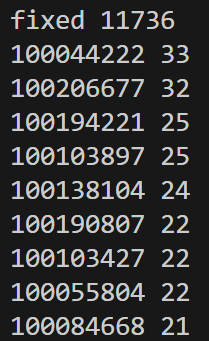
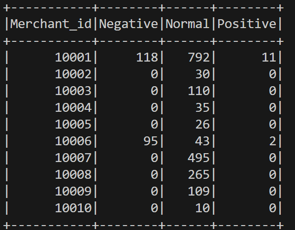
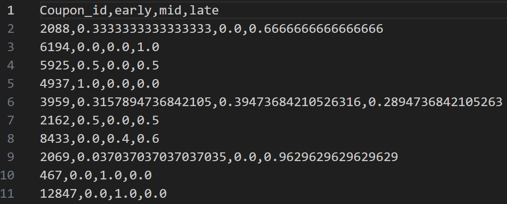
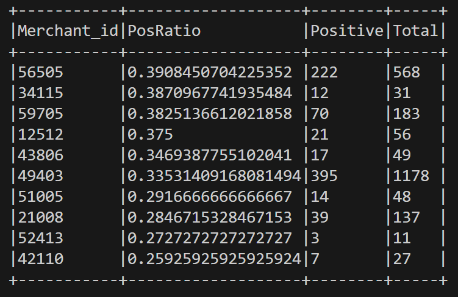
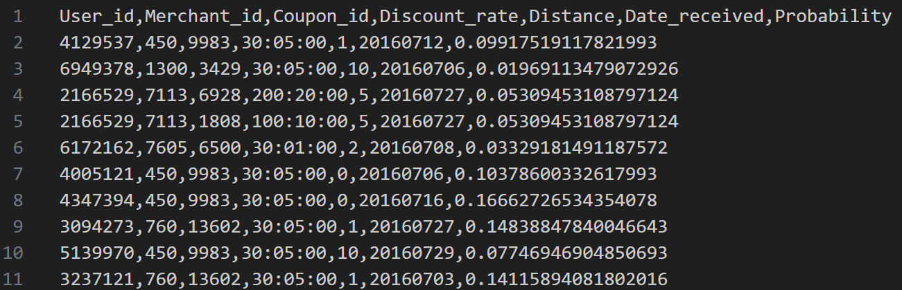

# exp4
金融大数据实验四

## 任务一：Spark RDD 编程

### （1）统计优惠券发放数量

- **目标**：使用 `ccf_online_stage1_train.csv` 统计每种优惠券的被使用次数，并按数量降序排列输出。
- **实现思路（RDD）**：
  - **读取数据**：从 HDFS 读取 CSV；取首行作为表头并过滤掉表头行。
  - **过滤有效记录**：仅保留 `Coupon_id` 非空且 `Date`（使用日期）非空的记录，表示“该券被使用过”。
  - **计数与排序**：将每条记录映射为 `(couponId, 1)`，用 `reduceByKey` 聚合；再按次数降序排序。
  - **结果输出**：保存完整排序结果到 HDFS，并在控制台打印 Top 10。
- **代码位置**：`code/CouponUsageCountRDD.scala`
- **结果文件**：`result/task1-CouponUsageCountRDD.txt`

**前 10 名优惠券**

### （2）查询指定商家优惠券使用情况

- **目标**：使用 `ccf_online_stage1_train.csv` 统计每个商家的优惠券使用情况，分为负样本、普通消费、正样本三种，按照 `Merchant_id` 升序排序。
- **实现思路（RDD）**：
  - **读取数据**：读取 CSV 并过滤表头。
  - **分类计数**：对每条记录提取 `Merchant_id`、`Coupon_id`、`Date`，按以下规则生成三类计数：
    - **负样本（Negative）**：`Coupon_id` 非空 且 `Date` 为空。
    - **普通消费（Normal）**：`Date` 非空 且 `Coupon_id` 为空。
    - **正样本（Positive）**：`Coupon_id` 非空 且 `Date` 非空。
  - **聚合与排序**：以 `Merchant_id` 为 key 做 `reduceByKey` 累加三类计数，转为 DataFrame 后按 `Merchant_id` 升序 `orderBy`。
  - **结果输出**：写出带表头的 CSV（合并为 1 个分片方便查看），并展示前 10 行。
- **代码位置**：`code/OnlineConsumptionRDD.scala`
- **结果文件**：`result/online_consumption_table.csv`

**前 10 行结果**

## 任务二：Spark SQL 编程

### （1）优惠券使用时间分布统计

- **目标**：根据 `ccf_offline_stage1_train.csv`表中数据，统计每一种优惠券被使用时间位于一个月的上中下旬。给出每一种优惠券被使用的分布。
- **实现思路（Spark SQL）**：
  - **过滤已用券记录**：保留 `Coupon_id` 与 `Date` 均非空的记录。
  - **提取日期并分段**：从 `Date` 取出“日”，映射到 `early/mid/late` 三段。
  - **统计比例**：按 `(Coupon_id, Period)` 计数并除以该券总使用次数得到比例 `prob`，再 pivot 成三列 `early/mid/late`。
- **代码位置**：`code/CouponUsageTimeDistribution.scala`
- **结果文件**：`result/CouponUsageTimeDistribution.csv`

**结果展示**

### （2）商家正样本比例统计

- **目标**：根据 `online_consumption_table`表中数据，按正样本比例对商家排序，给出正样本比例最高的前十个商家。
- **实现思路（Spark SQL）**：读取 `online_consumption_table` 建临时视图，SQL 计算 `PosRatio`，按 `PosRatio` 降序 `LIMIT 10`。
- **代码位置**：`code/TopMerchantsSQL.scala`
- **结果展示**：截图如下（仅要求前十个）。

## 任务三：Spark MLlib 编程

### 预测用户领券后 15 天内是否使用（输出使用概率）

- **目标**：使用 Spark MLlib 提供的机器学习模型，预测用户在2016 年 7 月领取优惠券后 15 天以内的使用情况，输出每条记录的使用概率 `Probability`。
- **标签定义（训练集）**：在 `ccf_offline_stage1_train.csv` 中，先筛选`Date_received` 非空且 `Coupon_id` 非空，然后若 `Date` 非空且与 `Date_received` 的间隔天数 \(0 ≤ diff ≤ 15\) 则 `label=1`，否则 `label=0`。
- **特征构造（与代码列名一致）**：
  - **折扣数值化 `discount_rate_num`**（由 `Discount_rate` 转换）：
    - 当 `Discount_rate` 为`null`：置为 `1.0`（等价于无折扣）。
    - 当 `Discount_rate` 为满减形式 `x:y(:00)`：转换为 \((x-y)/x\)。
    - 否则为直接折扣,转为 `Double`。
  - **是否满减 `is_manjian`**：若 `Discount_rate` 包含 `:` 则为 `1`，否则为 `0`。
  - **距离 `distance`**：若 `Distance` 为 `null` 则用 `10` 填充，否则转为 `int`。
  - **领取日期特征**：将 `Date_received` 解析为日期 `date_received_dt`，再提取：
    - `received_day`：当月第几天（`dayofmonth`）
    - `received_week`：一年中的第几周（`weekofyear`）
  - **类别特征编码**：
    - `User_id` → `user_idx`（`StringIndexer(handleInvalid="keep")`）
    - `Merchant_id` → `merchant_idx`（`StringIndexer(handleInvalid="keep")`）
  - **向量化**：`VectorAssembler` 将下列特征按顺序拼成 `features`：
    `discount_rate_num, is_manjian, distance, received_day, received_week, user_idx, merchant_idx`。
- **训练过程（Pipeline）**：
  - **训练数据准备**：从 `ccf_offline_stage1_train.csv` 读取数据，保留领过券的记录（`Coupon_id` 与 `Date_received` 非空），并按上面的规则生成 `label` 与全部特征列。
  - **模型训练**：使用 Pipeline 串联 `StringIndexer`、`VectorAssembler`、`LogisticRegression`，在训练集上 `fit` 得到模型。
- **预测与输出过程**：
  - **读取测试集**：读取 `ccf_offline_stage1_test_revised.csv`，用同样的特征工程生成测试特征列。
  - **模型预测**：`model.transform(testFeature)` 得到 `probability`（二分类概率向量）。
  - **提取正类概率**：将 `probability` 转为数组，取下标 1 作为 `Probability`（表示“15 天内用券”的概率）。
  - **结果落盘**：输出字段为 `User_id, Merchant_id, Coupon_id, Discount_rate, Distance, Date_received, Probability`。
- **模型**：`LogisticRegression`（Pipeline：`StringIndexer` + `VectorAssembler` + LR）。
- **代码位置**：`code/O2OCouponPredict.scala`
- **结果文件**：`result/task3-ccf_offline_stage1_test_revised.csv`（ `Probability` 列）

**部分结果展示**

## 实验感受与收获

- **对 Spark 三种编程范式的理解更清晰**：通过 RDD、Spark SQL、MLlib 三部分任务，对Spark编程有了整体认识。
- **数据清洗的重要性**：本次数据中 `null`较多，是否正确过滤与填充会直接影响统计与模型效果。
- **特征工程是模型效果的关键**：任务三将折扣形式（满减/折扣）数值化、构造时间特征与类别编码，让模型能更好地学习用户用券行为模式。
- **实践能力提升**：熟悉了 HDFS/本地路径读写、结果输出、以及使用 `Pipeline` 统一训练与预测流程。